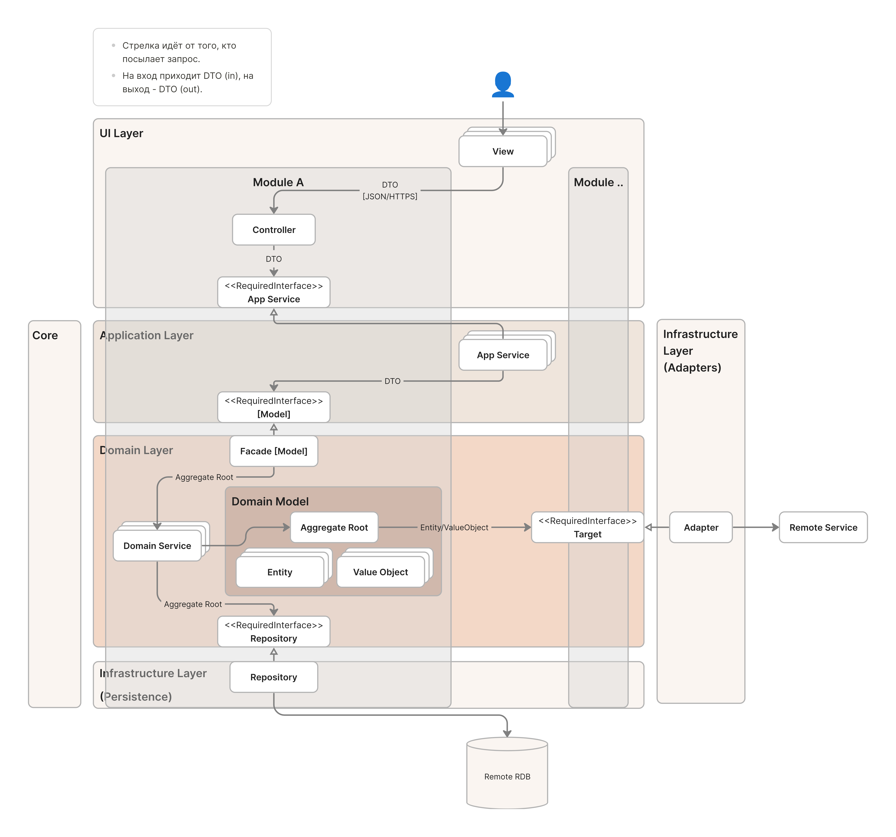

> Цель документа: описать архитектуру и обосновать принятые технические решения.

# Архитектура веб-приложения

Ключевыми критериями для выбора архитектурных решений были:
- Масштабируемость. Следование принципам SOLID и вытекающим из них правилам иерархической декомпозиция системы на модули, которые слабосвязаны снаружи, но сплоченны внутри (low coupling, high cohesion).
- Простота и быстрота разработки (особенно контейнеризация).
- Простота тестирования.
- Безопасность.
- Надежность.

> В основе архитектуры веб-приложения заложены принципы модульного монолита (Modular Monolith), слоистой архитектуры (Layered architecture), MVC и предметно-ориентированного проектирования (DDD).

## Модульный монолит и субдомены

Причиной выбора модульного монолита была цель: взять максимум от микросервисов в плане разбиения системы на независимые модули, но, при этом, не выносить их в отдельные Docker-контейнеры для ускорения разработки, деплоя всю кодовую базу в рамках единого контейнера.
Кроме того, разбиение системы на модули дает следующие преимущества:
- Упрощение переиспользования кода: нет нужды создавать отдельный сервис или библиотеку с общим кодом или дублировать код между отдельными сервисами.
- Четкое разделение ответственности: каждый модуль выполняет только те задачи, которые определены его контекстом, и ничего не знает о внутреннем устройстве других модулей, что упрощает разработку и тестирование.
- Минимизация зависимостей: модули слабо связаны между собой, что уменьшает риски появления багов при внесении изменений

Далее система была разделена на уровне домена путем выделения субдоменов (subdomains) с их ограниченными контекстами. Это позволило реализовать правило "low coupling, high cohesion" на уровне субдоменов.

Реализацией субдомена в рамках модульного монолита является модуль. Он имеет четкий интерфейс, скрывающий внутреннюю структуру модуля, с помощью которого клиент может взаимодействовать с доменной бизнес-логикой. К примеру, для того, чтобы проверить, существует ли пользователь, модуль `User` предоставляет интерфейс с методом `bool existsById(int userId)`, инкапсулируя от клиента информацию о сущности `User`. Неправильным решением было бы возвращать саму сущность: `User getById(userId)`.

## Декомпозиция системы: переход от MVC к Layered Architecture

После необходимо было иерархически декомпозировать веб-приложение на слои, чтобы разделить ответственность между компонентами. Это позволило применить на практике принципы SOLID.

Принципы, заложенные в основе MVC, позволили произвести первую иерархическую декомпозицию, разделяя приложение на два слоя: Domain Model и UI. Первый отвечает за бизнес-логику и функциональность, а второй - за логику отображения Модели и взаимодействия с пользователем. Такое разделение допустило разработку бизнес-логики и функциональности без учета деталей отображения данных, позволяя использовать одну Модель для разных типов UI: GUI (Descktop/Mobile) или CLI.

Однако такого разделения не достаточно, ибо MVC говорит, **что** делает Domain Model, но не **как**. Даже несмотря на то, что в MVC Domain Model реализует бизнес-логику с помощью совокупности доменных сущностей, каждая из которых отражает объект реального мира, непонятно, **кто и как** будет выполнять доступ к инфраструктурным компонентам (БД, внешние сервисы и т.д.) и **кто и как** будет использовать и координировать действия независимых модулей (субдоменов), реализующих доменную бизнес-логику.

Ответы на эти вопросы лежат в слоистой архитектуре. Где за инфраструктурные детали отвечает слой инфраструктуры, а за использование модулей и выполнения логики приложения - слой приложения. Между слоем приложения и инфраструктуры находится слой домена, который и описывается в MVC.

Отсюда можно выделить 4 слоя:
1. Слой пользовательского интерфейса (UI Layer): отвечает за логику представления и взаимодействия с пользователем. Включает Views, Controllers и templates.
2. Слой приложения (Application Layer): отвечает за реализацию Use Case'ов приложения (бизнес-логики приложения), координируя модулями (субдоменами); не содержит доменных бизнес-правил. Включает AppServices, содержащих UseCases, и DTOs.
3. Слой домена (Domain Layer): отвечает за реализацию доменной бизнес-логики - определение доменных бизнес-правил. Пример: возраст пользователя должен быть больше 18 лет. Включает доменные объекты (Aggregates, Entities, ValueObjects) и DomainServices.
4. Слой инфраструктуры (Infrastructure Layer): отвечает за хранине и извлечение данных из хранилищ данных, а также за взаимодействие с внешними сервисами. Включает Repositories, DAOs, Adapters.

Слой общается только с прямым нижним слоем и только через требуемый интерфейс (RequiredInterface). Это позволяет реализовать принципы SOLID:
- SRP - каждый слой имеет свою ответственность;
- OCP - т.к. слои зависят от абстракции, можно добавлять новые реализации интерфейсов;
- LSP - мы можем создать отдельную реализацию интерфейса в целях тестирования, не нарушая работу клиента;
- ISP - каждый верхний слой требует от нижнего только то, что ему нужно;
- DIP - каждый верхний слой зависит от абстракции (предоставляемого интерфейса) и не взаимодействует с нижним напрямую, раскрывая его детали реализации.

Таким образом, данная архитектура является масштабируемой и простой в тестировании. К примреу, Domain Layer тестируется юнит-тестами, Application Layer - интеграционными с моками репозиториев, UI Layer - E2E (сквозными) тестами.

На данной диаграмме изображена обобщенная архитектура проекта:

	

